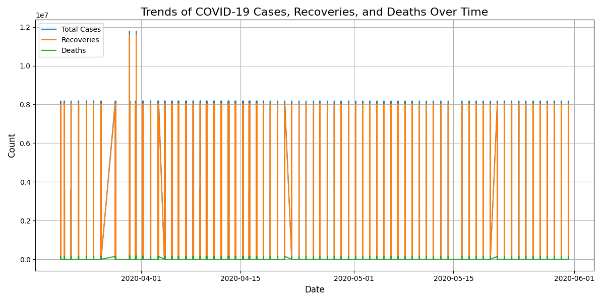
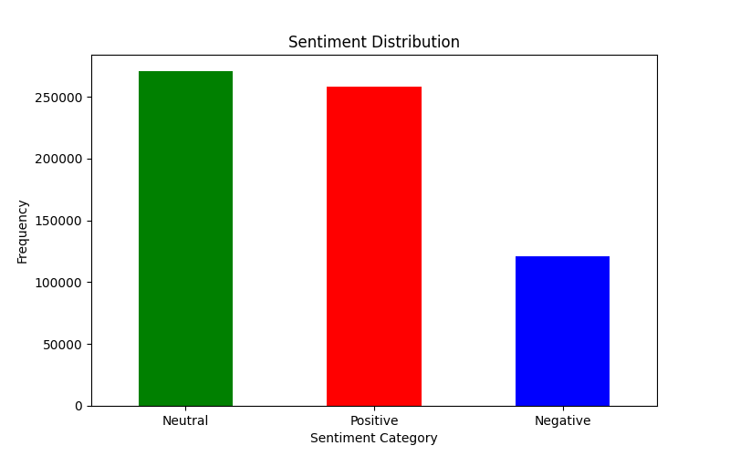
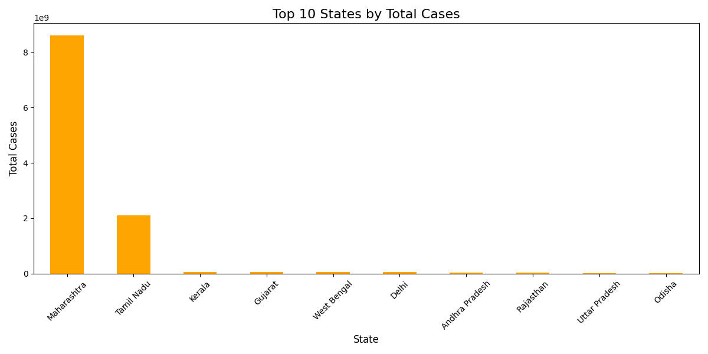

# COVID-19 Dashboard Project

## Overview
This project is a COVID-19 Dashboard that provides insights into the pandemic using data visualizations, sentiment 
analysis, and predictive modeling. It allows users to analyze trends, visualize correlations, and predict COVID-19 cases
based on input data. Built using Python and Flask, this project showcases interactive graphs and tables to deliver 
meaningful information about the pandemic.

## Features
- **Interactive Dashboard**: Displays line plots, bar charts, heatmaps, and pie charts for COVID-19 data.
- **Sentiment Analysis**: Analyzes public sentiment data by state and visualizes weighted sentiments.
- **Predictive Modeling**: Uses machine learning to predict COVID-19 case trends.
- **Dynamic Tables**: View detailed state-wise sentiment data on a separate page.
- **User-Friendly Design**: Clean and responsive interface with Bootstrap integration.

## 📊 Visualizations

### Line Plot - Trends Over Time


### Forecast Covid-19


### Heatmap correlation


### Sentiment Distribution


### Top 10 States Cases


## Installation
### Prerequisites
- Python 3.8 or higher
- Pip (Python package manager)
- A code editor (e.g., PyCharm)

### Steps
1. Clone the repository to your local machine:
   ```bash
   git clone https://github.com/Riya72-coder/covid-19-analysis-and-dashboard.git
   ```

2. Navigate to the project directory:
   ```bash
   cd covid-dashboard
   ```

3. Install the required Python libraries:
   ```bash
   pip install -r requirements.txt
   ```

4. **Download the Datasets**
   Due to GitHub's file size limits, the large datasets are not included in this repository. Please download them from their original sources on Kaggle:

   *   **Sentiment Data:** (https://www.kaggle.com/datasets/abhaydhiman/covid19-sentiments) (Rename downloaded file to `COVID-19_Sentiments.csv`)
   *   **Main Analysis Data:** (https://www.kaggle.com/datasets/akcoguz/outputcsb) (Rename downloaded file to `output.csv`)
   *   **Vaccination Data:** https://www.kaggle.com/datasets/joebeachcapital/india-covid-vaccination-by-state-2023(Rename downloaded file to `IndiaCovidVaccination2023.csv`)

   **Action:** Place these CSV files inside the `data/` folder of this project.

5. Run the Flask application:
   ```bash
   python flask_app.py
   ```

6. Open your browser and navigate to:
   ```plaintext
   http://127.0.0.1:5000/
   ```

## Project Structure
```plaintext
covid-19-project/
├── data/                      # Folder for CSV datasets
├── static/                    # CSS and image assets (plots and graphs)
├── templates/                 # HTML templates (dashboard.html)
├── build_data.py              # Main data analysis and visualization script
├── flask_app.py               # Main Flask application
├── covid_model.pkl            # Pre-trained machine learning model
└── requirements.txt           # Python dependencies
```

## Technologies Used
- **Backend**: Flask (Python)
- **Frontend**: HTML, CSS, Bootstrap
- **Data Visualization**: Matplotlib, Seaborn
- **Machine Learning**: Scikit-learn
- **Data Processing**: Pandas, NumPy

## How to Use the Project
1. **View the Dashboard**: Open the main dashboard page to see COVID-19 visualizations and insights.
2. **Access Sentiment Data**: Click on the "View Weighted Sentiment by State" link to explore detailed sentiment data.
3. **Predict Cases**: Enter a numerical input on the prediction page to see the model's forecast of COVID-19 cases.

## License
This project is licensed under the [MIT License](LICENSE). You are free to use, modify, and distribute this project with 
proper attribution.

## Acknowledgments
- Thanks to [John Hopkins University](https://github.com/CSSEGISandData/COVID-19) for providing the COVID-19 dataset.
- Special thanks to the team members and contributors who supported this project.
- Libraries and frameworks: Flask, Matplotlib, Bootstrap, Scikit-learn.

---
Feel free to contribute to this project by submitting issues or pull requests!
